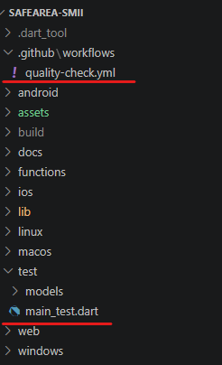
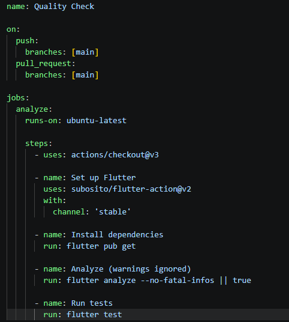
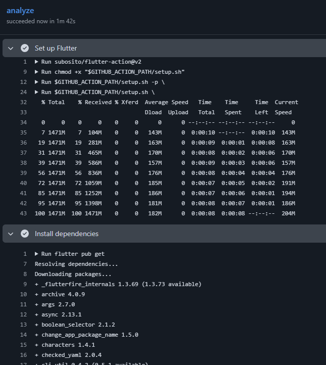
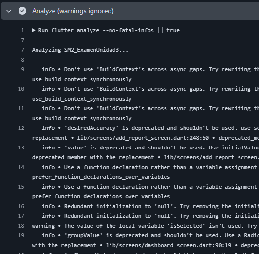
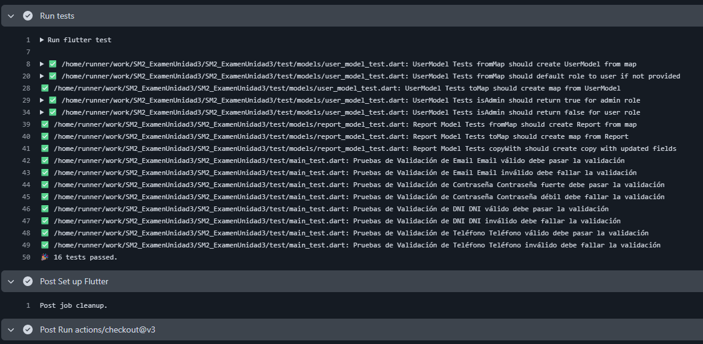
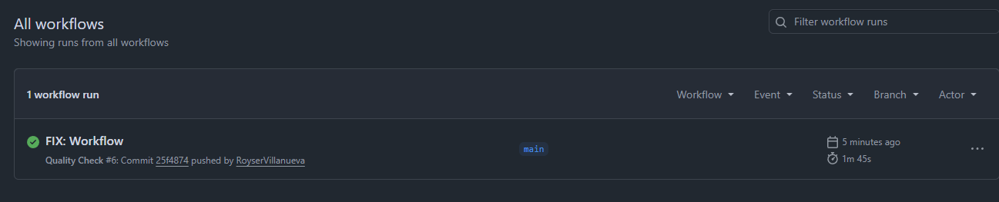
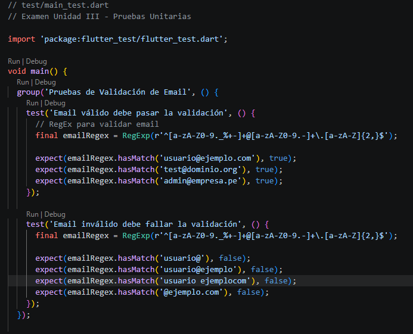

# Soluciones Móviles II

### Fecha: 23/06/2026
### Nombre completo del estudiante: Royser Alonsso Villanueva Mamani
### URL: https://github.com/RoyserVillanueva/SM2_ExamenUnidad3.git
---

# Evidencias

### 1. Estructura de las carpetas



### 2. Contenido del archivo quality-check.yml



### 3. Ejecución del workflow en la pestaña de Actions

#### Ejecutar el entorno e instalar las dependencias


#### Analisis


#### Pruebas unitarias


#### Pestaña de GitHub Actions


### 4. Explicación de lo realizado

1. Primeramente se creara el repositorio en GitHub con el nombre solicitado, y siguiente se clonara el contenido del proyecto de Unidad realizado a lo largo del curso. Para este caso se utiliza SafeArea.

2. Para la estructura de las carpetas, sera construido de la siguiente manera.

```text
.github/workflows/  → Para almacenar los workflows de GitHub Actions
test/               → Para almacenar las pruebas unitarias
```
3. Se creara el archivo quality-check.yml en .github/workflows/. Para este caso se configuraria Flutter en el runner, siguiendo se instalaria las dependencias, se verifica la calidad y el codigo y por último se ejecutara las pruebas unitarias.
4. Para las pruebas unitarias se crearon 8, dentro de test/main_test.dart para validad; 1. Email valido, 2. Email Invalido, 3. Contraseña fuerte, 4. Contraseña debil, 5. DNI valido, 6. DNI invalido, 7. Teléfono válido, 8. Teléfono inválido.


5. El workflow se activara automáticamente en la rama main. 

